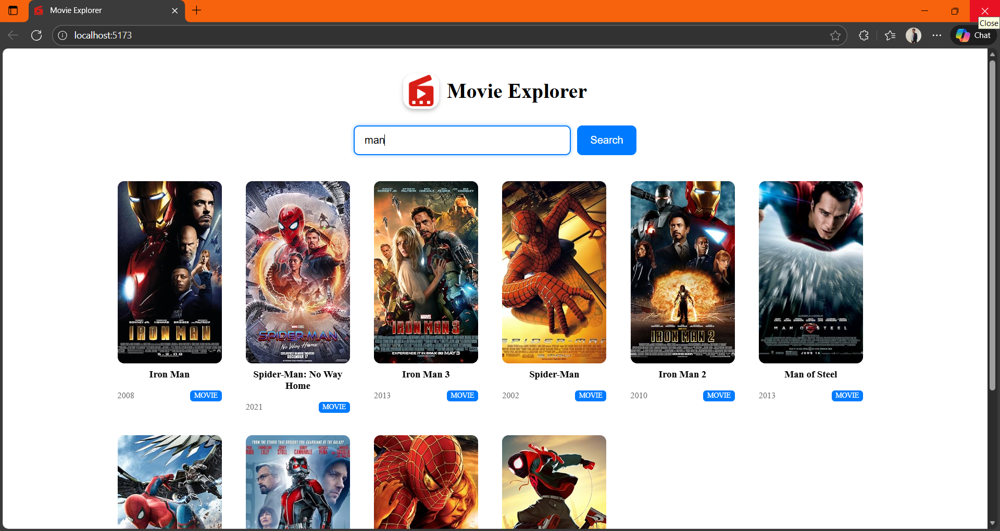
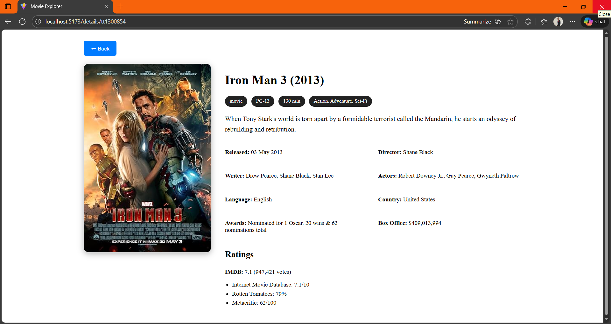
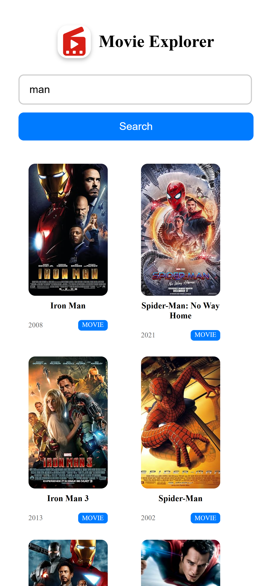

<div align="center">

# 🎬 Movie Explorer  
### A Modern & Fast Movie Search Platform (React + Spring Boot)


🔗 **Live Frontend:** not available

🔗 **Backend API:** not available 

🔗 **GitHub Repo:** https://github.com/mulayharshal/Movie-Explorer.git
</div>

---

## 🏆 Overview

**Movie Explorer** is a full-stack movie browsing platform that provides a smooth and responsive experience for discovering movies, series, and episodes.

Users can:

- 🔎 Search movies by title  
- 🎬 View full movie details  
- ⭐ Check ratings (IMDb, Rotten Tomatoes, Metacritic)  
- 📱 Use on any device (fully responsive)  
- ⚡ Enjoy fast performance through smart caching  
- 💾 Automatically restore the last search  

---

## 🛠️ Backend (Web Service API)

The backend is developed with **Spring Boot** and provides a clean **REST API layer** between the frontend and the OMDB API.

### ✔ Features

- 🛰 **RESTful endpoints** for search & movie details  
- 🔐 Secure API key handling using environment variables  
- ⚡ **In-memory caching**  
  - Cache expiry  
  - Max size limit  
- 🚀 Fast HTTP client using RestTemplate  
- 🧹 Error handling (invalid title, no results, API failure)  
- 🏗 Extensible architecture for future expansion  

### ✔ API Endpoints

#### 🔍 Search Movie  
```
GET /api/movies/search?title=Iron Man
```

#### 🎬 Movie Details  
```
GET /api/movies/details?id=tt0371746
```


---

## 🎨 Frontend (UI Layer)

Built using **React + Vite** with clean, modern, responsive design.

### ✔ Features

- 🔎 Search dashboard with instant results  
- 🎞 Grid layout of movies (poster, title, year, type)  
- 🎬 Detailed movie page  
  - Poster  
  - Director  
  - Genre  
  - Plot  
  - Actors  
  - Ratings list  
- 💾 Last search auto-restored (localStorage)  
- 🟦 Beautiful movie cards (9:16 poster ratio)  
- 🧩 Easy navigation with React Router  
- 📱 Fully responsive for all devices  
- 🎨 Polished UI for production use  

---

## 🧰 Tech Stack

<div align="center">

| Frontend | Backend | API Source | Deployment |
|----------|----------|-------------|-------------|
| ⚛️ React (Vite) | ☕ Spring Boot | 🎥 OMDB API | 🌐 Netlify (Frontend) |
| 🎨 CSS | 🔧 RestTemplate | | ☁ Render (Backend) |

</div>

---

## 🚀 Getting Started

### 1️⃣ Clone the repository

```bash
git clone https://github.com/mulayharshal/Movie-Explorer.git
cd movie-explorer
```

---

# 🟦 Frontend Setup (React + Vite)

```bash
cd frontend-movie-explorer
npm install
npm run dev
```

Runs at:

```
http://localhost:5173/
```

Create `.env`:

```
VITE_API_URL=http://localhost:8080/api
VITE_WEBSITE_NAME=Movie Explorer
```

---

# 🟩 Backend Setup (Spring Boot)

```bash
cd backend-movie-explorer
mvn spring-boot:run
```

Set your API key:

```
OMDB_API_KEY=your_api_key_here
```

Backend runs at:

```
http://localhost:8080
```

---

## 📸 Screenshots

### 🔍 Search Page  


### 🎬 Movie Details  


### 📱 Mobile Responsive  



---

👨‍💻 **Developer**  
**Harshal Mulay**  
📍 India  
🔗 GitHub: https://github.com/mulayharshal  

<div align="center">
⭐ If you like this project, please give the repository a star!
</div>
